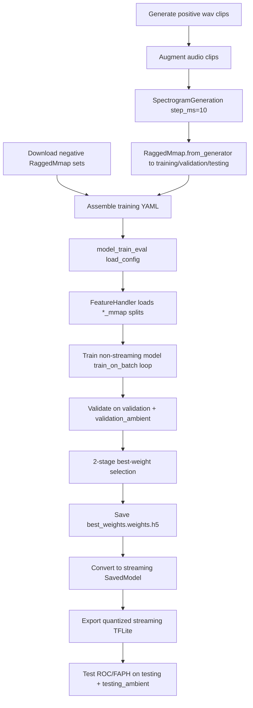

# microWakeWord Training Pipeline Deep-Dive (Integration Evidence)

## Scope and sources

Analyzed in `/tmp/microWakeWord`:
- `notebooks/basic_training_notebook.ipynb`
- `microwakeword/data.py` (especially `FeatureHandler`)
- `microwakeword/train.py`
- `microwakeword/audio/spectrograms.py`
- `microwakeword/audio/audio_utils.py`
- `microwakeword/model_train_eval.py`
- `microwakeword/layers/modes.py`
- `microwakeword/mixednet.py`
- `README.md`

Compared against workbench exporter:
- `src/wakeword_workbench/export/microwakeword.py`

---

## End-to-end notebook workflow (`basic_training_notebook.ipynb`)

1. Install/train environment
   - Installs microWakeWord and dependencies.

2. Generate positive wake-word audio
   - Uses Piper sample generator to create wake-word `.wav` clips.

3. Build augmentation assets
   - Downloads impulse responses and background audio datasets.

4. Configure augmentation + clip loading
   - `Clips(...)` points to generated wake-word audio.
   - `Augmentation(...)` adds EQ/distortion/pitch/noise/reverb/gain/jitter.

5. Convert audio -> spectrogram features -> RaggedMmap
   - `SpectrogramGeneration(..., step_ms=10, slide_frames=10)` for train/val.
   - `slide_frames=1` for testing.
   - Saves output using `RaggedMmap.from_generator(..., out_dir=.../wakeword_mmap)`.

6. Pull pre-generated negative feature sets
   - Downloads negative RaggedMmap datasets from Hugging Face.

7. Write training YAML
   - Defines feature sets, weights, training schedule, class weights, metrics.

8. Train + export/evaluate
   - Runs `python -m microwakeword.model_train_eval ... mixednet ...`.
   - Trains non-streaming model, selects best weights, converts to streaming TFLite.

---

## What microWakeWord expects as input data

## 1) On-disk feature storage format

`FeatureHandler` in `data.py` only consumes:
- Feature-set entries where `type: mmap` (or `clips` for runtime augmentation path)
- Directory trees containing split subdirs:
  - `training/`
  - `validation/`
  - `testing/`
  - optional `validation_ambient/`
  - optional `testing_ambient/`
- Inside each split: folders matching `**/*_mmap/` that are valid `mmap_ninja.ragged.RaggedMmap` datasets.

Important: this is **RaggedMmap folder format**, not a flat `.mmap` data file with sidecar indices.

## 2) In-memory sample shape and dtype

Each loaded sample is a single spectrogram clip:
- shape: `(time_frames, 40)`
- 40 feature channels are hardcoded in model input shape (`modes.py`).
- dtype:
  - if `uint16`, `FeatureHandler` rescales by `* 0.0390625`
  - otherwise typically `float32`

## 3) Feature extraction definition

`audio_utils.generate_features_for_clip(...)` uses microfrontend settings:
- sample rate: 16000 Hz
- window size: 30 ms
- window step: `step_ms` (10 ms in notebook/training config)
- channels/features per frame: 40
- lower band: 125 Hz
- upper band: 7500 Hz
- includes PCAN/noise reduction behavior from microfrontend path

---

## Exact conversion map: Workbench export -> microWakeWord training input

Workbench currently produces two variants:

1) `export_to_mmap(...)`
- `{split}_data.mmap` (flat concatenated float32 audio)
- `{split}_indices.npy` (start/end sample indices)
- `{split}_labels.npy` (0/1)

2) `export_with_features(...)`
- `{split}_data.npy` (concatenated mel frames)
- `{split}_indices.npy`, `{split}_labels.npy`, `{split}_durations.npy`, `{split}_shape.npy`

### Compatibility result

Neither variant is directly consumable by microWakeWord `FeatureHandler(type="mmap")`.

Reasons:
- microWakeWord loader searches for `*_mmap/` directories (RaggedMmap), not `train_data.mmap` flat files.
- workbench mel features are librosa-based (`n_fft=2048`, default `hop_length=480`) and do not match microfrontend features used by microWakeWord.
- microWakeWord training expects per-clip ragged spectrogram arrays, not one flattened array plus index sidecars.

### Required conversion pipeline (workbench `.wav` -> RaggedMmap)

```text
Workbench manifest + wav files
  -> for each clip: generate microfrontend features (40 bins, 30ms window, 10ms step)
  -> optional augmentation/sliding policy depending on split
  -> emit per-clip arrays shaped (T, 40)
  -> write RaggedMmap folder under split dir, e.g. training/wakeword_mmap/
  -> reference split parent dir in microWakeWord config.features[].features_dir
```

### Mapping table

| Workbench artifact | microWakeWord equivalent | Action needed |
|---|---|---|
| `train_data.mmap` (flat audio) | `training/*_mmap/` RaggedMmap of spectrogram clips | Rebuild into RaggedMmap folders |
| `*_indices.npy` (sample index) | internal ragged indexing | Re-encode into RaggedMmap format |
| `*_labels.npy` | `truth` is per feature-set config (not per-row label array) | Split/export by class into separate feature sets or map labels into per-set dirs |
| librosa mel (`n_fft=2048`, `hop_length=480`) | microfrontend 40-dim features (`window=30ms`, `step=10ms`) | Regenerate features with microfrontend-compatible extractor |

---

## FeatureHandler behavior details that affect integration

- Random training batch composition:
  - picks provider by `sampling_weight` using `random.choices(...)`
- Loss weighting:
  - provider-level `penalty_weight` multiplied by class weight (`positive_class_weight`/`negative_class_weight`)
- Truncation strategies:
  - `random`, `truncate_start`, `truncate_end`, `none`, `fixed_right_cutoff`, and `split` (ambient eval path)
- Ambient evaluation:
  - `validation_ambient`/`testing_ambient` uses `split` behavior with stride `int(1000 * step * stride)` (100 ms when `step=0.01`, `stride=10`?; notebook path commonly yields 100 ms behavior with configured defaults)

Note: `if mode == "testing" or "validation":` in `data.py` always shuffles due to Python truthiness; this affects validation/testing order but not compatibility.

---

## Configuration parameters and defaults

## A) YAML training config keys (`training_parameters.yaml`)

From notebook example + defaults in `train.py` / `model_train_eval.py`.

| Key | Default if omitted | Source |
|---|---:|---|
| `train_dir` | none (required) | notebook usage / `model_train_eval.py` |
| `features` | none (required) | `FeatureHandler` expects it |
| `clip_duration_ms` | none (required) | used in `load_config` for spectrogram length |
| `batch_size` | none (required in practice) | used in train/eval calls |
| `eval_step_interval` | none (required in practice) | used in training loop modulus |
| `window_step_ms` | `20` | `model_train_eval.py` |
| `training_steps` | `[20000]` | `train.py` |
| `learning_rates` | `[0.001]` | `train.py` |
| `mix_up_augmentation_prob` | `[0.0]` | `train.py` |
| `freq_mix_augmentation_prob` | `[0.0]` | `train.py` |
| `time_mask_max_size` | `[5]` | `train.py` |
| `time_mask_count` | `[2]` | `train.py` |
| `freq_mask_max_size` | `[5]` | `train.py` |
| `freq_mask_count` | `[2]` | `train.py` |
| `positive_class_weight` | `[1.0]` | `train.py` |
| `negative_class_weight` | `[1.0]` | `train.py` |
| `target_minimization` | none (required for selection logic) | training loop uses directly |
| `minimization_metric` | none in notebook example (`None`) | notebook / training loop |
| `maximization_metric` | none (required) | training loop uses directly |

Training lists are auto-padded to match `len(training_steps)` by repeating the last value.

## B) `features[]` entry keys

For `type: mmap`:
- required: `features_dir`, `truth`, `sampling_weight`, `penalty_weight`, `truncation_strategy`, `type`
- optional: `fixed_right_cutoffs` (default `[0]`)

For `type: clips`:
- required keys include `clips_settings`, `augmentation_settings`, `spectrogram_generation_settings` plus class/weight/truncation metadata.

## C) CLI flags (`model_train_eval.py`) defaults

| Flag | Default |
|---|---:|
| `--training_config` | `trained_models/model/training_parameters.yaml` |
| `--train` | `1` |
| `--test_tf_nonstreaming` | `0` |
| `--test_tflite_nonstreaming` | `0` |
| `--test_tflite_nonstreaming_quantized` | `0` |
| `--test_tflite_streaming` | `0` |
| `--test_tflite_streaming_quantized` | `1` |
| `--restore_checkpoint` | `0` |
| `--use_weights` | `best_weights` |

MixedNet-specific defaults (used in notebook command family):
- `pointwise_filters="48, 48, 48, 48"`
- `residual_connection="0,0,0,0,0"`
- `repeat_in_block="1,1,1,1"`
- `mixconv_kernel_sizes="[5], [9], [13], [21]"`
- `max_pool=0`, `first_conv_filters=32`, `first_conv_kernel_size=3`, `spatial_attention=0`, `pooled=0`, `stride=1`

---

## 2-stage process documentation

There are two relevant "2-stage" concepts:

1) Detection-time 2-stage (README)
   - Stage 1: audio -> 40-dim feature slice every 10 ms (microfrontend)
   - Stage 2: streaming NN consumes newest slice and outputs wake-word probability stream

2) Training-time 2-stage best-weight selection (`train.py` + README)
   - Stage A (primary objective): minimize `minimization_metric` until below `target_minimization`
   - Stage B (secondary objective): once target is met, maximize `maximization_metric`
   - If target not met yet, continue preferring lower minimization metric

---

## Training workflow diagram (mermaid)



---

## Integration code snippets

## A) microWakeWord-compatible feature generation pattern

```python
from mmap_ninja.ragged import RaggedMmap
from microwakeword.audio.spectrograms import SpectrogramGeneration

spectrograms = SpectrogramGeneration(clips=clips, augmenter=augmenter, step_ms=10, slide_frames=10)
RaggedMmap.from_generator(
    out_dir="generated_augmented_features/training/wakeword_mmap",
    sample_generator=spectrograms.spectrogram_generator(split="train", repeat=2),
    batch_size=100,
    verbose=True,
)
```

## B) microWakeWord data loading expectation

```python
from microwakeword.data import FeatureHandler

config = {
    "features": [{
        "features_dir": "generated_augmented_features",
        "truth": True,
        "sampling_weight": 2.0,
        "penalty_weight": 1.0,
        "truncation_strategy": "truncate_start",
        "type": "mmap",
    }],
    "stride": 1,
    "window_step_ms": 10,
}
handler = FeatureHandler(config)
```

## C) Gap to current workbench exporter

```python
# Current workbench output is flat arrays + indices, not RaggedMmap folders.
# A converter is needed before FeatureHandler can read it.
```

---

## Conclusion for WakeWord Workbench integration

Current exporter output is **not directly plug-compatible** with microWakeWord training.

Minimum integration requirement:
- Add an adapter/export path that writes microWakeWord-style RaggedMmap folders per split and per feature-set, with per-clip arrays shaped `(T, 40)` generated from the same microfrontend assumptions (16 kHz, 30 ms window, 10 ms step by default).

Without this adapter, microWakeWord `FeatureHandler(type="mmap")` will not discover or correctly interpret workbench artifacts.
