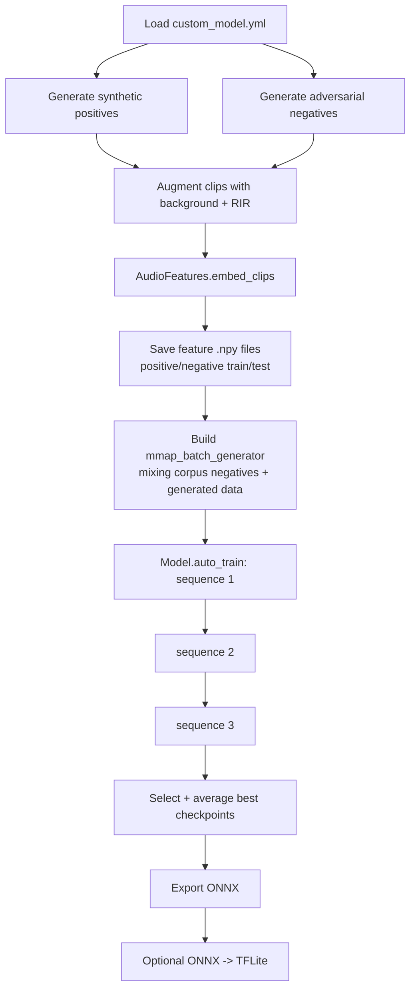

# Task 2 Evidence: openWakeWord Training Pipeline Deep Dive

## Scope and sources

Analyzed upstream `openWakeWord` at `/tmp/openWakeWord` (origin: `https://github.com/dscripka/openWakeWord`).

Primary files reviewed:
- `notebooks/automatic_model_training.ipynb`
- `notebooks/training_models.ipynb`
- `openwakeword/utils.py` (`AudioFeatures`, `compute_features_from_generator`)
- `openwakeword/train.py` (`Model`, `auto_train`, CLI pipeline)
- `openwakeword/data.py` (`mmap_batch_generator`)
- `examples/custom_model.yml`

Workbench comparison files:
- `src/wakeword_workbench/export/openwakeword.py`
- `src/wakeword_workbench/export/microwakeword.py`

---

## 1) What openWakeWord actually trains on

`openWakeWord` training consumes **precomputed embedding tensors**, not raw audio.

- Expected per-example tensor shape in model code defaults to `input_shape=(16, 96)` (`openwakeword/train.py`).
- Training loader reads `.npy` feature files via memmap (`openwakeword/data.py:mmap_batch_generator`).
- Feature files are grouped by class/source (e.g., positive, adversarial negative, large negative corpus), not one `X.npy + y.npy` pair.

### Meaning of `(16, 96)`

- `96` = embedding dimension output by Google speech embedding backend.
- `16` = number of embedding frames for ~2.0 s clips in default auto-training path.

From `AudioFeatures` logic (`openwakeword/utils.py`):

1. Audio -> melspectrogram with fixed frame stride of 160 samples.
2. Mel frames are windowed with `window_size=76`, `step_size=8`.
3. Each 76x32 mel window is fed to embedding model -> 96-d vector.
4. Number of embedding frames:

`embedding_frames = (mel_frames - 76) // 8 + 1`, where `mel_frames = ceil(samples/160 - 3)`.

For 32000 samples (2.0 s @ 16 kHz):

- `mel_frames = ceil(32000/160 - 3) = 197`
- `embedding_frames = (197 - 76)//8 + 1 = 16`

Hence `16 x 96`.

---

## 2) Exact feature extraction process (audio -> 16x96)

Pipeline (from `AudioFeatures.embed_clips`):

1. **Input constraints**
   - 16-bit PCM, 16 kHz (`int16` expected in `_get_melspectrogram`).

2. **Mel stage**
   - ONNX/TFLite melspectrogram model (fixed mel bins = 32).
   - Batch mel output shape: `(N, mel_frames, 32)`.

3. **Embedding stage**
   - Sliding 76-frame mel windows with stride 8.
   - Each window shape: `(76, 32, 1)`.
   - Embedding model output dim = 96.
   - Clip-level output shape: `(N, embedding_frames, 96)`.

4. **For default 2s training clips**
   - `embedding_frames = 16` => final tensor `(N, 16, 96)`.

### Important nuance from notebooks

- `training_models.ipynb` tutorial uses `clip_size = 3` seconds in the manual walkthrough, producing larger time dimension (not 16).
- `automatic_model_training.ipynb` + `train.py` auto pipeline often lands at 2.0 s minimum (`total_length >= 32000`), which yields 16 frames.

So `(N, 16, 96)` is **default/common**, not mathematically fixed for all clip durations.

---

## 3) Three-sequence auto training process

`Model.auto_train()` in `openwakeword/train.py` runs three sequential phases:

1. **Sequence 1**
   - LR = `1e-4`
   - Steps = `steps` (config default 50000)
   - Negative weight schedule: linear `1 -> max_negative_weight`
   - Warmup and hold schedule applied

2. **Sequence 2**
   - LR reduced by 10x
   - Steps reduced by 10x
   - If validation FP/hr > target: doubles `max_negative_weight`
   - Retrains with updated schedule

3. **Sequence 3**
   - LR reduced by another 10x
   - Same shorter step count as sequence 2
   - Again can double negative weight if FP/hr remains above target

After all sequences:
- Candidate checkpoints are filtered by percentile thresholds (`val_accuracy`, `val_recall`, `val_fp_per_hr`).
- Selected checkpoints are averaged into final model.

---

## 4) Training workflow (end-to-end)



Notebook mapping:
- `automatic_model_training.ipynb`: orchestrates CLI steps (`--generate_clips`, `--augment_clips`, `--train_model`).
- `training_models.ipynb`: educational manual path (explicit feature prep + simple PyTorch classifier).

---

## 5) Configuration parameter table (from `examples/custom_model.yml`)

| Parameter | Default | Role in pipeline |
|---|---:|---|
| `model_name` | `"my_model"` | Naming output dirs/files |
| `target_phrase` | `["hey jarvis"]` | Positive class text(s) |
| `custom_negative_phrases` | `[]` | Extra hard negatives |
| `n_samples` | `10000` | Train synthetic positives/adv negatives |
| `n_samples_val` | `2000` | Validation synthetic samples |
| `tts_batch_size` | `50` | Piper generation batch size |
| `augmentation_batch_size` | `16` | Clip augmentation batch size |
| `piper_sample_generator_path` | `./piper-sample-generator` | TTS generator dependency |
| `output_dir` | `./my_custom_model` | All generated artifacts |
| `rir_paths` | `./mit_rirs` | Reverb augmentation inputs |
| `background_paths` | `./background_clips` | Background mix inputs |
| `background_paths_duplication_rate` | `[1]` | Per-source oversampling |
| `false_positive_validation_data_path` | `./validation_set_features.npy` | FP/hr validation corpus |
| `augmentation_rounds` | `1` | Reuse synthetic clips with stochastic augmentation |
| `feature_data_files` | `{"ACAV100M_sample": ...}` | External negative feature corpora |
| `batch_n_per_class` | `{ACAV100M_sample:1024, adversarial_negative:50, positive:50}` | Class composition per training batch |
| `model_type` | `"dnn"` | `dnn` or `rnn` |
| `layer_size` | `32` | FC hidden width |
| `steps` | `50000` | Base step count for sequence 1 |
| `max_negative_weight` | `1500` | Upper bound for negative loss weighting |
| `target_false_positives_per_hour` | `0.2` | FP/hr target steering sequences 2/3 |

---

## 6) Mapping: Workbench export -> openWakeWord expected format

## Current workbench output

`src/wakeword_workbench/export/openwakeword.py` writes:
- `X_{split}.npy`
- `y_{split}.npy`
- `format="raw"` (1D audio) or `format="mel"` (time x 96 log-mel)

## openWakeWord trainer expectation

`train.py` expects:
- `config["feature_data_files"]`: dict of **class/source -> feature file path**
- each feature file is a 3D array shaped `(N, T, 96)` where T must match model input time axis
- labels are inferred from source key/transform (`positive` -> 1, others -> 0)
- no direct `X.npy + y.npy` ingest path

## Gap summary

1. Workbench `raw` and `mel` outputs are **not directly consumable** by openWakeWord auto-trainer.
2. Workbench `mel` uses 96 mel bins via librosa, but openWakeWord expects **post-embedding 96-d features**, not raw mel.
3. Workbench single `X/y` split format differs from openWakeWord per-class file dictionary.

## Required adapter steps

Given workbench `.wav` manifests:

1. Build fixed-duration PCM clips at 16 kHz int16 (prefer 32000 samples for default 16 frames).
2. Run `openwakeword.utils.AudioFeatures.embed_clips` -> `(N,16,96)`.
3. Save class-specific arrays:
   - `positive_features_train.npy`
   - `adversarial_negative_features_train.npy` (or generated by train.py)
   - optional large negative corpora feature files
4. Populate `feature_data_files` + `batch_n_per_class` in YAML.
5. Provide separate false-positive validation features file for FP/hr tuning.

---

## 7) Integration snippets (minimal, no code copy into project)

### A) Convert workbench exported raw clips to openWakeWord embeddings

```python
import numpy as np
from openwakeword.utils import AudioFeatures

X_raw = np.load("X_train.npy")  # expected shape (N, samples), int16-like PCM windowed/padded
F = AudioFeatures(device="cpu")
X_emb = F.embed_clips(X_raw.astype(np.int16), batch_size=256, ncpu=8)  # -> (N, T, 96)
np.save("positive_features_train.npy", X_emb.astype(np.float32))
```

### B) Build class-specific feature files from `X/y`

```python
import numpy as np

X = np.load("X_train_embeddings.npy")   # (N, T, 96)
y = np.load("y_train.npy")              # (N,)

np.save("positive_features_train.npy", X[y == 1])
np.save("negative_features_train.npy", X[y == 0])
```

### C) Wire into openWakeWord training config

```yaml
feature_data_files:
  ACAV100M_sample: ./openwakeword_features_ACAV100M_2000_hrs_16bit.npy
  positive: ./positive_features_train.npy
  adversarial_negative: ./negative_features_train.npy

batch_n_per_class:
  ACAV100M_sample: 1024
  adversarial_negative: 50
  positive: 50
```

---

## 8) Key differences vs microWakeWord approach

Compared using workbench exporter implementations and openWakeWord trainer expectations.

1. **Feature representation**
   - openWakeWord: Google speech embedding features (96-d), typically `(T,96)` with T around 16 for 2s windows.
   - microWakeWord export path in workbench: raw audio mmap or mel features (default 40 mel, hop 480).

2. **Training data format**
   - openWakeWord: multiple per-source `.npy` feature files + class-balanced mmap generator.
   - microWakeWord exporter: ragged concatenated arrays + indices/labels metadata.

3. **Optimization objective and loop**
   - openWakeWord auto-train directly targets false positives/hour with staged negative weighting and checkpoint averaging.
   - microWakeWord pipeline in this repo is export-oriented and does not implement equivalent three-sequence FP/hr-driven training logic.

4. **Temporal framing**
   - openWakeWord classifier runs on embedding frames built from 80 ms stride (`step_size=8` mel frames).
   - microWakeWord feature export currently tied to its own mel front-end settings (40 mel, 30 ms hop in exporter helper).

---

## 9) Practical integration recommendation for WakeWord Workbench

For robust openWakeWord compatibility, prefer an exporter mode that writes **embedded features** (not just mel):

- input: fixed-size 16k PCM clips
- backend: `openwakeword.utils.AudioFeatures.embed_clips`
- output: per-class `.npy` files with shape `(N,16,96)` when using 2s windows
- config artifact: generated `custom_model.yml` fragment (`feature_data_files`, `batch_n_per_class`, fp validation path)

This aligns exactly with upstream `train.py` ingestion path and avoids format mismatch with `X_{split}.npy` / `y_{split}.npy`.
