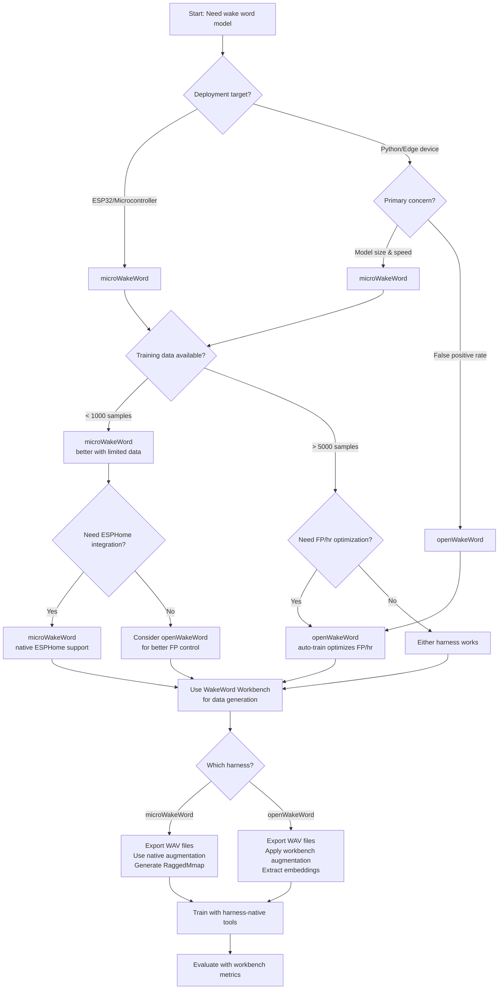

# Integration Guide: microWakeWord vs openWakeWord

**Choosing the Right Training Harness for Your Wake Word Model**

This guide helps you choose between microWakeWord and openWakeWord training harnesses, understand their differences, and integrate them with WakeWord Workbench.

## Setup checkpoint

Before running integration steps, bootstrap from repo root:

```bash
uv sync --group dev
source .venv/bin/activate
uv run wakeword-workbench --help
uv run wakeword-workbench validate examples/basic_config.yaml
```

If validation fails due to backend availability, install `uv sync --extra kokoro` or `uv sync --extra piper`.

---

## Quick Decision

| Choose microWakeWord if you need... | Choose openWakeWord if you need... |
|-------------------------------------|-----------------------------------|
| Streaming inference on microcontrollers | Robust false positive rejection |
| Compact models with low memory footprint | Automatic FP/hr optimization |
| ESPHome integration | Large negative corpus support |
| Limited training data (hundreds of samples) | ONNX model deployment |
| TensorFlow Lite deployment | Research and experimentation |

---

## Comparison Overview

### At a Glance

| Aspect | microWakeWord | openWakeWord |
|--------|---------------|--------------|
| **Repository** | [OHF-Voice/micro-wake-word](https://github.com/OHF-Voice/micro-wake-word) | [dscripka/openWakeWord](https://github.com/dscripka/openWakeWord) |
| **Stars** | ~800 | ~2,100 |
| **Focus** | Embedded devices, ESPHome | Flexibility, research, custom models |
| **Feature Type** | 40-dim mel spectrogram | 96-dim Google speech embedding |
| **Model Format** | TFLite (streaming) | ONNX / TFLite |
| **Training Approach** | 2-stage weight selection | 3-sequence auto-train |
| **Data Requirements** | 100-1000 positives | 10,000+ positives (default) |
| **Deployment Target** | ESP32, microcontrollers | Python runtime, edge devices |

---

## Decision Flowchart



---

## Architecture Comparison

### Feature Extraction Pipeline

**microWakeWord:**
```
Audio (16 kHz)
    ↓
Microfrontend (30ms window, 10ms step)
    ↓
40-dim mel spectrogram
    ↓
Streaming TFLite model
    ↓
Wake word probability
```

**openWakeWord:**
```
Audio (16 kHz, int16)
    ↓
Melspectrogram (32 mel, stride 160)
    ↓
Sliding window (76 frames, stride 8)
    ↓
Google speech embedding model
    ↓
96-dim embeddings (T frames)
    ↓
DNN/RNN classifier
    ↓
Wake word probability
```

### Key Architectural Differences

| Aspect | microWakeWord | openWakeWord |
|--------|---------------|--------------|
| **Frontend** | Lightweight microfrontend | Google speech embedding model |
| **Feature Dimension** | 40 | 96 |
| **Temporal Resolution** | 10 ms per frame | ~80 ms per embedding frame |
| **Model Architecture** | MixedNet (depthwise separable conv) | DNN or RNN |
| **Streaming Support** | Native streaming TFLite | Requires ONNX runtime |
| **Memory Footprint** | Lower (simpler features) | Higher (embedding model) |

### Training Methodology

**microWakeWord (2-stage selection):**
1. Train non-streaming model
2. Select best weights by minimizing `minimization_metric` (e.g., FAR)
3. Once target met, maximize `maximization_metric` (e.g., accuracy)
4. Convert to streaming TFLite

**openWakeWord (3-sequence auto-train):**
1. **Sequence 1:** Train with LR=1e-4, negative weight ramps up
2. **Sequence 2:** Reduce LR 10x, double negative weight if FP/hr > target
3. **Sequence 3:** Reduce LR 10x again, double negative weight if needed
4. Filter checkpoints by percentile thresholds
5. Average best checkpoints into final model

---

## Installation

### microWakeWord

```bash
# Clone repository
git clone https://github.com/OHF-Voice/micro-wake-word.git
cd micro-wake-word

# Install dependencies
pip install -e .

# Optional: Download pre-trained models
git clone https://github.com/esphome/micro-wake-word-models.git
```

**Requirements:**
- Python 3.11+
- TensorFlow 2.x
- mmap_ninja
- numpy, scipy

**External Dependencies:**
- Piper sample generator (for TTS-based positive generation)
- Pre-generated negative datasets from Hugging Face

### openWakeWord

```bash
# Clone repository
git clone https://github.com/dscripka/openWakeWord.git
cd openWakeWord

# Install dependencies
pip install -e .

# Download embedding models (automatic on first use)
python -c "from openwakeword.utils import AudioFeatures; AudioFeatures()"
```

**Requirements:**
- Python 3.8+
- PyTorch or ONNX Runtime
- numpy, scipy
- openwakeword package

**External Dependencies:**
- Piper sample generator (for TTS-based positive generation)
- Large negative corpora (ACAV100M_sample recommended)

---

## Quick Start

### microWakeWord Workflow

**1. Generate positive samples with WakeWord Workbench:**

```yaml
# config.yaml
wake_word: "hey assistant"

samples:
  positives: 500
  negatives_multiplier: 3

tts:
  providers:
    - backend: "kokoro"
      voices:
        - "af_sarah"
        - "am_adam"
        - "af_bella"
      speed: 1.0

augmentation:
  # DISABLE for microWakeWord - use native augmentation
  noise_snr: [0, 0]
  reverb_probability: 0.0
  gain_range: [0, 0]

output:
  path: "./output/microwakeword"
  format: ["microwakeword"]
```

```bash
# Generate samples
uv run wakeword-workbench run config.yaml
```

**2. Convert to microWakeWord format:**

```python
from pathlib import Path
import numpy as np
from mmap_ninja.ragged import RaggedMmap
from microwakeword.audio.audio_utils import generate_features_for_clip

# Load audio from workbench output
audio_dir = Path("./output/microwakeword/audio")
output_dir = Path("./microwakeword_data")

# Generate spectrograms for each clip
for split in ["train", "val", "test"]:
    for class_name in ["wakeword", "negative"]:
        clips = load_clips_from_manifest(audio_dir / f"{split}.jsonl")
        
        spectrograms = []
        for audio in clips:
            spec = generate_features_for_clip(
                audio.astype(np.float32),
                sample_rate=16000,
                window_size_ms=30,
                window_step_ms=10,
                num_channels=40,
            )
            spectrograms.append(spec)
        
        # Write RaggedMmap
        RaggedMmap.from_generator(
            out_dir=str(output_dir / split / f"{class_name}_mmap"),
            sample_generator=iter(spectrograms),
            batch_size=100,
        )
```

**3. Create training config:**

```yaml
# training_parameters.yaml
train_dir: "./microwakeword_data"
features:
  - features_dir: "./microwakeword_data"
    truth: true
    sampling_weight: 2.0
    penalty_weight: 1.0
    truncation_strategy: "truncate_start"
    type: "mmap"

clip_duration_ms: 1000
batch_size: 32
window_step_ms: 10
training_steps: [20000]
learning_rates: [0.001]
positive_class_weight: [1.0]
negative_class_weight: [1.0]
target_minimization: 0.05
maximization_metric: "accuracy"
```

**4. Train:**

```bash
python -m microwakeword.model_train_eval \
  --training_config training_parameters.yaml \
  --test_tflite_streaming_quantized 1
```

### openWakeWord Workflow

**1. Generate samples with WakeWord Workbench:**

```yaml
# config.yaml
wake_word: "hey assistant"

samples:
  positives: 10000
  negatives_multiplier: 2

tts:
  providers:
    - backend: "kokoro"
      voices:
        - "af_sarah"
        - "am_adam"
      speed: 1.0

augmentation:
  # ENABLE for openWakeWord
  noise_snr: [-10, 10]
  reverb_probability: 0.5
  gain_range: [-45, 0]

output:
  path: "./output/openwakeword"
  format: ["openwakeword"]
```

```bash
# Generate samples
uv run wakeword-workbench run config.yaml
```

**2. Convert to openWakeWord embeddings:**

```python
from pathlib import Path
import numpy as np
from openwakeword.utils import AudioFeatures

# Initialize feature extractor
features = AudioFeatures(device="cpu")

# Load audio from workbench output
audio_dir = Path("./output/openwakeword/audio")
output_dir = Path("./openwakeword_features")
output_dir.mkdir(exist_ok=True)

# Process each split
for split in ["train", "val"]:
    for class_name, label in [("positive", 1), ("adversarial_negative", 0)]:
        clips = load_clips_from_manifest(
            audio_dir / f"{split}.jsonl",
            label_filter=label,
            target_samples=32000,  # 2 seconds
        )
        
        # Stack and convert to int16
        audio_batch = np.stack([
            (clip * 32767).astype(np.int16) for clip in clips
        ])
        
        # Extract embeddings
        embeddings = features.embed_clips(audio_batch, batch_size=256, ncpu=8)
        
        # Save
        np.save(
            output_dir / f"{class_name}_features_{split}.npy",
            embeddings.astype(np.float32)
        )
```

**3. Create training config:**

```yaml
# custom_model.yml
model_name: "hey_assistant"
target_phrase: ["hey assistant"]
n_samples: 10000
n_samples_val: 2000
output_dir: "./trained_model"

feature_data_files:
  positive: ./openwakeword_features/positive_features_train.npy
  adversarial_negative: ./openwakeword_features/adversarial_negative_features_train.npy
  ACAV100M_sample: ./path/to/ACAV100M_sample.npy

batch_n_per_class:
  positive: 50
  adversarial_negative: 50
  ACAV100M_sample: 1024

model_type: "dnn"
layer_size: 32
steps: 50000
max_negative_weight: 1500
target_false_positives_per_hour: 0.2
```

**4. Train:**

```python
from openwakeword.train import Model

model = Model()
model.auto_train(
    config="custom_model.yml",
    steps=50000,
    max_negative_weight=1500,
    target_false_positives_per_hour=0.2,
)
```

---

## Use Case Recommendations

### ESPHome Integration

**Recommended: microWakeWord**

microWakeWord has native ESPHome integration with pre-built components:

```yaml
# ESPHome configuration
external_components:
  - source: github://OHF-Voice/micro-wake-word
    components: [micro_wake_word]

micro_wake_word:
  model: "hey_assistant"
  on_wake_word:
    - logger.log: "Wake word detected!"
```

**Why microWakeWord:**
- Streaming TFLite models designed for ESP32
- Low memory footprint (~200KB)
- Native ESPHome component
- Pre-trained models available

**Integration path:**
1. Use WakeWord Workbench to generate positive samples
2. Train with microWakeWord
3. Export quantized streaming TFLite
4. Deploy to ESPHome

---

### Custom Hardware (ARM Cortex-M)

**Recommended: microWakeWord**

For resource-constrained microcontrollers:

**Why microWakeWord:**
- Simpler feature extraction (40-dim mel)
- Smaller model size
- Streaming inference without external dependencies
- TensorFlow Lite Micro compatible

**Considerations:**
- Requires careful quantization
- May need model pruning for very tight memory budgets
- Test on target hardware early

---

### Research and Experimentation

**Recommended: openWakeWord**

For research projects and model experimentation:

**Why openWakeWord:**
- Flexible architecture (DNN or RNN)
- Easy to modify training parameters
- ONNX format for portability
- Active research community

**Advantages:**
- Can experiment with different negative corpora
- Automatic FP/hr optimization
- Checkpoint averaging for robustness
- Python-based inference for rapid prototyping

---

### Production Edge Deployment

**Depends on requirements:**

| Requirement | Recommendation |
|-------------|----------------|
| Lowest latency | microWakeWord |
| Lowest FP rate | openWakeWord |
| Smallest model | microWakeWord |
| Easiest deployment | microWakeWord (ESPHome) |
| Most robust | openWakeWord |

**Hybrid approach:**
1. Train both models
2. Evaluate on target hardware
3. Choose based on FAR/FRR trade-offs
4. Consider ensemble if resources allow

---

### Limited Training Data

**Recommended: microWakeWord**

When you have fewer than 1000 positive samples:

**Why microWakeWord:**
- Designed for small datasets
- 2-stage selection helps with limited data
- Can leverage pre-generated negative datasets
- Lower risk of overfitting

**Tips:**
- Use multiple TTS voices
- Apply aggressive augmentation (via microWakeWord native pipeline)
- Download official negative datasets
- Start with 500-1000 positives

---

### Large-Scale Training

**Recommended: openWakeWord**

When you have 10,000+ positive samples:

**Why openWakeWord:**
- Auto-train optimizes for FP/hr
- Can leverage large negative corpora (ACAV100M)
- 3-sequence training handles scale well
- Checkpoint averaging improves robustness

**Tips:**
- Use WakeWord Workbench for data generation
- Apply augmentation during workbench pipeline
- Download ACAV100M_sample for negatives
- Target FP/hr < 0.5

---

## Integration with WakeWord Workbench

### What Workbench Provides

| Feature | microWakeWord | openWakeWord |
|---------|---------------|--------------|
| TTS generation | ✅ Use | ✅ Use |
| Phonetic confusion generation | ✅ Use | ✅ Use |
| Dataset splitting | ✅ Use | ✅ Use |
| Hard negative mining | ✅ Use | ✅ Use |
| Evaluation metrics | ✅ Use | ✅ Use |
| Augmentation | ❌ Don't use | ✅ Use |
| Feature export | ❌ Don't use | ❌ Don't use |

### What to Use Harness-Native Tools For

| Task | microWakeWord | openWakeWord |
|------|---------------|--------------|
| Feature extraction | SpectrogramGeneration | AudioFeatures.embed_clips() |
| Augmentation | Augmentation class | Workbench (before embedding) |
| Negative datasets | Hugging Face downloads | ACAV100M_sample |
| Model training | model_train_eval | Model.auto_train() |
| Model export | TFLite conversion | ONNX export |

### Critical Integration Points

**DO:**
- Use workbench for TTS, splitting, mining, evaluation
- Export WAV files from workbench
- Use harness-native feature extraction
- Use microWakeWord native augmentation (not workbench)
- Use openWakeWord embedding extraction

**DON'T:**
- Use workbench mel/mmap exporters for training data
- Apply workbench augmentation before microWakeWord pipeline
- Use workbench feature extraction (wrong format for both harnesses)
- Mix harness-specific formats without conversion

---

## Performance Comparison

### Model Size

| Harness | Model Size | Memory (Runtime) |
|---------|-----------|------------------|
| microWakeWord (quantized) | ~200-500 KB | ~1-2 MB |
| openWakeWord (ONNX) | ~1-5 MB | ~10-20 MB |

### Inference Speed

| Harness | Latency (typical) | Throughput |
|---------|------------------|------------|
| microWakeWord (ESP32) | 10-50 ms | Real-time |
| openWakeWord (CPU) | 5-20 ms | Real-time |

### Accuracy (Typical)

| Harness | FAR (per hour) | FRR | Notes |
|---------|---------------|-----|-------|
| microWakeWord | 0.1-1.0 | 1-5% | Depends on training data |
| openWakeWord | 0.05-0.5 | 1-3% | Auto-optimized for FP/hr |

**Note:** Actual performance depends heavily on:
- Quality and quantity of training data
- Negative coverage
- Wake word complexity
- Deployment environment

---

## Common Pitfalls

### microWakeWord

| Pitfall | Symptom | Solution |
|---------|---------|----------|
| Wrong directory structure | `FeatureHandler` can't find data | Use `{split}/{class}_mmap/` folders |
| Using workbench augmentation | Double augmentation, poor results | Disable workbench augmentation |
| Wrong feature extraction | Poor model performance | Use microfrontend, not librosa |
| Missing RaggedMmap | `KeyError` | Use `mmap_ninja.ragged.RaggedMmap` |

### openWakeWord

| Pitfall | Symptom | Solution |
|---------|---------|----------|
| Wrong embedding shape | Shape mismatch error | Ensure 16 kHz int16 input |
| Using raw mel features | Poor performance | Use `AudioFeatures.embed_clips()` |
| Variable clip lengths | Inconsistent shapes | Pad/crop to fixed duration |
| Missing negative corpus | High FP rate | Download ACAV100M_sample |

---

## External Resources

### microWakeWord

- **Repository:** https://github.com/OHF-Voice/micro-wake-word
- **Pre-trained Models:** https://github.com/esphome/micro-wake-word-models
- **ESPHome Integration:** https://esphome.io/components/micro_wake_word.html
- **Training Notebook:** `notebooks/basic_training_notebook.ipynb`

### openWakeWord

- **Repository:** https://github.com/dscripka/openWakeWord
- **Documentation:** https://github.com/dscripka/openWakeWord#readme
- **Training Notebook:** `notebooks/automatic_model_training.ipynb`
- **Custom Model Guide:** `examples/custom_model.yml`

### WakeWord Workbench

- **Repository:** (project repository)
- **Data Format Reference:** `docs/training/data-format-reference.md`
- **Feature Mapping:** `.sisyphus/evidence/task-4-feature-mapping.md`

---

## Summary

### Choose microWakeWord When:

- ✅ Deploying to ESP32 or microcontrollers
- ✅ Need ESPHome integration
- ✅ Have limited training data (< 1000 samples)
- ✅ Want smallest possible model
- ✅ Need streaming inference without runtime dependencies

### Choose openWakeWord When:

- ✅ Need robust false positive rejection
- ✅ Have large training dataset (> 5000 samples)
- ✅ Want automatic FP/hr optimization
- ✅ Prefer ONNX deployment
- ✅ Doing research and experimentation

### Use WakeWord Workbench For:

- ✅ TTS-based positive sample generation
- ✅ Phonetic confusion generation
- ✅ Dataset splitting and organization
- ✅ Hard negative mining
- ✅ Evaluation metrics (FAR/FRR/ROC)

### Use Harness-Native Tools For:

- ✅ Feature extraction (both harnesses)
- ✅ Augmentation (microWakeWord only)
- ✅ Model training (both harnesses)
- ✅ Model export (both harnesses)

---

**Next Steps:**

1. Review the [Data Format Reference](data-format-reference.md) for conversion details
2. Check the [Feature Mapping Evidence](../../.sisyphus/evidence/task-4-feature-mapping.md) for compatibility matrix
3. Choose your harness based on the decision flowchart
4. Follow the quick-start workflow for your chosen harness

---

*Last updated: 2026-04-06*
*Based on Wave 1 analysis evidence*
